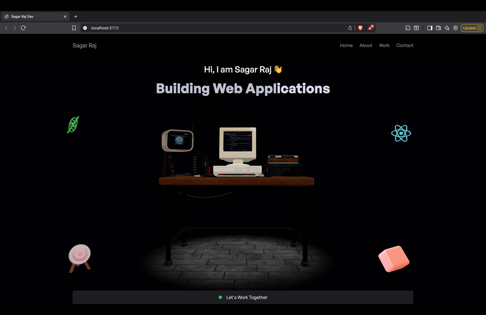

# 3D Developer Portfolio

A personal developer portfolio built with Next.js and Three.js to showcase my projects and skills in an interactive 3D environment.




**Live Demo:** [https://buildwithsagar.vercel.app/](https://buildwithsagar.vercel.app/) ✨

---
## Features

* **Interactive 3D Models:** Engage with dynamic 3D objects powered by Three.js.
* **Smooth Animations:** Fluid page transitions and animations using Framer Motion.
* **Responsive Design:** Fully responsive layout ensuring a great experience on all devices, from desktops to mobile phones.
* **Project Showcase:** A dedicated section to display and detail my professional work.
* **Contact Form:** Integrated contact functionality for easy communication.

---
## Tech Stack 🛠️

* **Framework:** [Next.js](https://nextjs.org/) 13+ (App Router)
* **Language:** [TypeScript](https://www.typescriptlang.org/)
* **3D Rendering:** [Three.js](https://threejs.org/) & [React Three Fiber](https://docs.pmnd.rs/react-three-fiber/getting-started/introduction)
* **Animation:** [Framer Motion](https://www.framer.com/motion/)
* **Styling:** [Tailwind CSS](https://tailwindcss.com/)
* **Deployment:** [Vercel](https://vercel.com/)

---
## Getting Started

To run this project locally, follow these steps.

### Prerequisites

Make sure you have Node.js (version 18.x or higher) and npm installed on your machine.

### Installation

1.  Clone the repository to your local machine:
    ```bash
    git clone [https://github.com/sagargse/threejs_portfolio.git](https://github.com/sagargse/threejs_portfolio.git)
    ```

2.  Navigate into the project directory:
    ```bash
    cd threejs_portfolio
    ```

3.  Install the necessary dependencies:
    ```bash
    npm install
    ```

4.  Run the development server:
    ```bash
    npm run dev
    ```

5.  Open [http://localhost:3000](http://localhost:3000) in your browser to see the result.

---
## Deployment 🚀

This project is deployed on **Vercel**. Any push or merge to the `main` branch will automatically trigger a new production deployment.